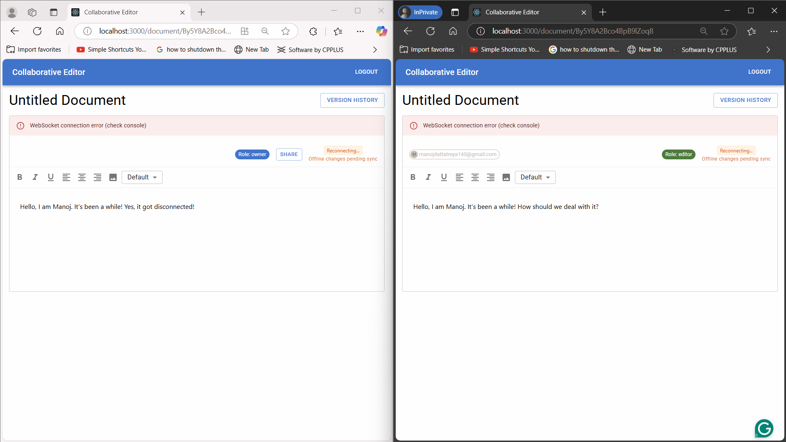
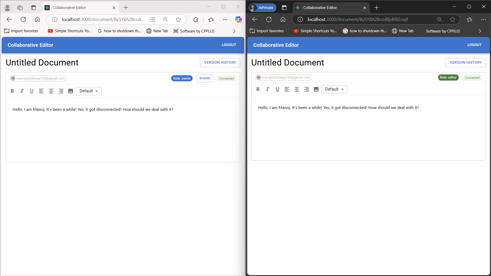

# Collaborative Sync: Real‑Time Collaborative Editor 


---

## 🌟 Project Overview

**Collaborative Sync** is an enterprise‑grade, real‑time text editor enabling multiple users to edit the same document seamlessly. Built on **TipTap** (ProseMirror), **Yjs CRDT**, and **WebSockets**, it delivers sub‑300ms end‑to‑end synchronization for up to 7,000+ concurrent collaborators.

---

## 🔥 Key Features

- **Real‑Time Collaboration**: Instantaneous shared editing with conflict‑free state merges.
- **Role‑Based Access**: Secure owner/editor/viewer permissions via Firebase Auth.
- **High Scalability**: Doc‑based routing ensures one in‑memory instance per document.
- **Snapshot Versioning**: Create and restore document snapshots on demand.
- **Dockerized**: Frontend and backend containers for consistent, production‑ready deployments.
- **AWS‑Managed**: Hosted on EC2 behind an Elastic Load Balancer for 99.9% uptime.

---

## 🏗️ Architecture

Refer to the **Figures/** directory for detailed diagrams:

- `Figures/architecture.png`: High‑level system design
- `Figures/workflow.png`: Client → LB → WebSocket → CRDT merge flow
- `Figures/docker-deploy.png`: Docker Compose & AWS ECS layout

<p align="center">
  
  

</p>

---

## 🛠️ Tech Stack

| Layer       | Technology               |
|:-----------:|:------------------------:|
| **Frontend**| React.js, TipTap, Zustand |
| **Backend** | Node.js, Express, ws, Yjs |
| **Sync**    | Yjs CRDT, y-websocket    |
| **Auth**    | Firebase Auth            |
| **Containerization** | Docker, Docker Compose |
| **Cloud**   | AWS EC2, Elastic Load Balancer |

---

## 🚀 Getting Started

Clone the repository:
```bash
git clone https://github.com/yourusername/collaborative-sync.git
cd collaborative-sync
```

### 1. Backend Setup
```bash
cd backend
npm install
cp .env.example .env         # fill in FIREBASE_, MONGO_ URIs
npm start                    # runs on port 1234 by default
```

### 2. Frontend Setup
```bash
cd ../frontend
npm install
cp .env.example .env         # set REACT_APP_API_ENDPOINT, REACT_APP_WEBSOCKET_ENDPOINT
npm start                    # opens http://localhost:3000
```

### 3. Docker Compose (All‑In‑One)
```bash
docker-compose up --build
```

Access the app at `http://localhost:3000`.

---

## ☁️ Production Deployment

1. **Build images** & push to ECR:
   ```bash
   docker build -t collaborative-sync-backend ./backend
   docker build -t collaborative-sync-frontend ./frontend
   # tag & push to AWS ECR...
   ```
2. **ECS/EKS**: Deploy services with desired count for auto‑scaling.
3. **Load Balancer**: Configure ALB for HTTP + WebSocket health checks.
4. **Domain & SSL**: Route53 + ACM for secure HTTPS.

---

## ✔️ Metrics & Monitoring

- **Sub‑300ms** sync latencies (avg)
- **40% memory reduction** via doc eviction
- **99.9% uptime** under 7k concurrent editors
- **Centralized logging** (CloudWatch) and **alerts** on high CPU

---

## 🤝 Contributing

1. Fork the repo
2. Create a branch (`git checkout -b feature/XYZ`)
3. Commit your changes (`git commit -m 'Add XYZ feature'`)
4. Push to branch (`git push origin feature/XYZ`)
5. Open a pull request

---

## 📜 License

This project is licensed under the **MIT License**. See [LICENSE](LICENSE) for details.

---

> Crafted by Manoj Myneni | GitHub: [@https://github.com/man0j-012](https://github.com/man0j-012) | LinkedIn: [https://www.linkedin.com/in/manoj1205/](https://www.linkedin.com/in/manoj1205/)

